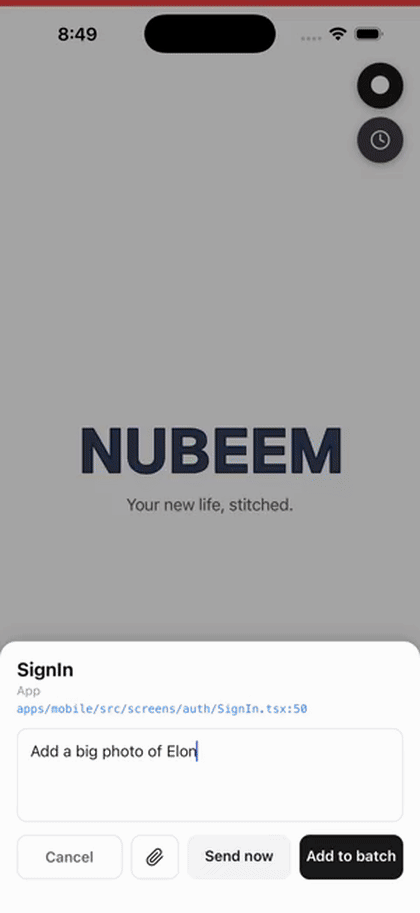
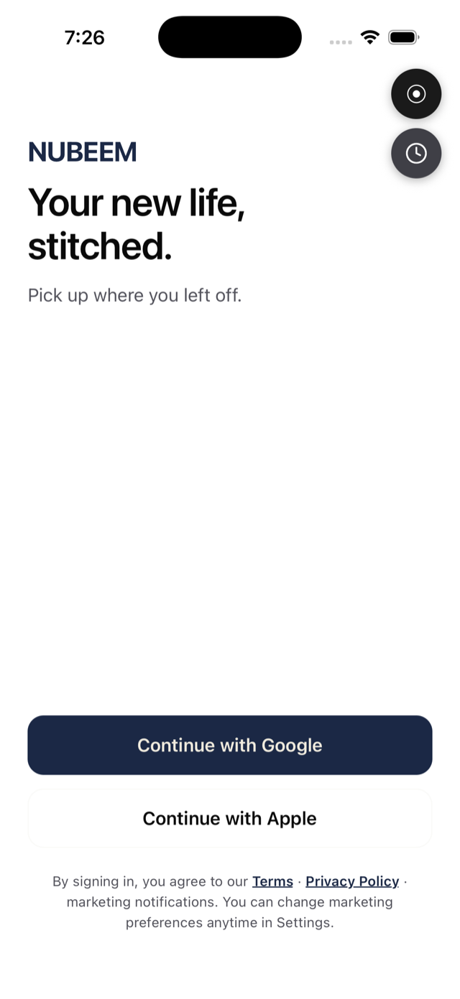
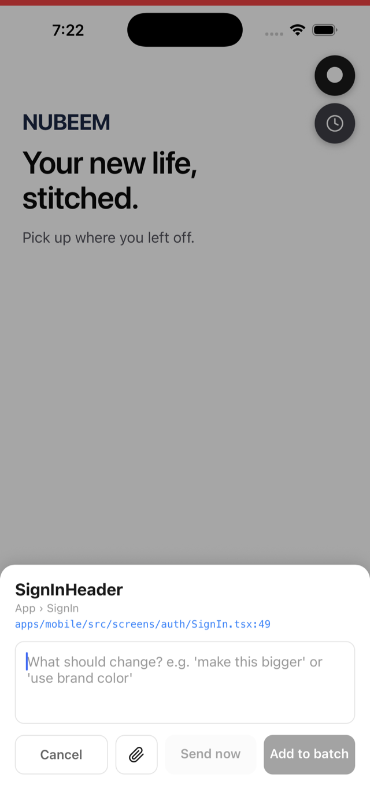
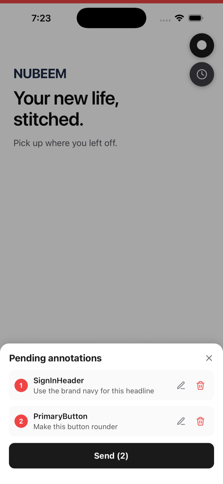
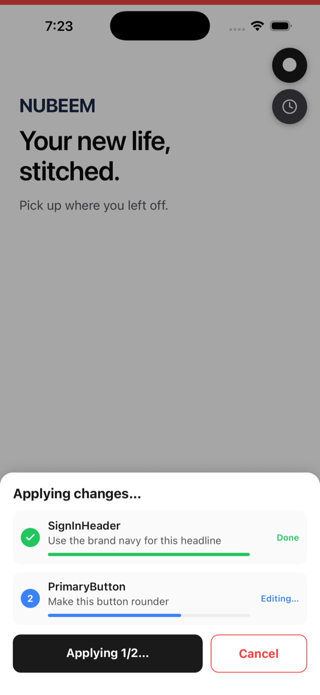
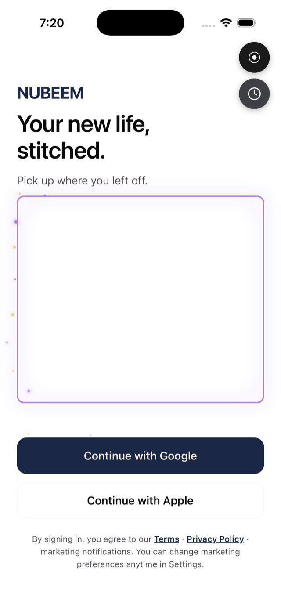
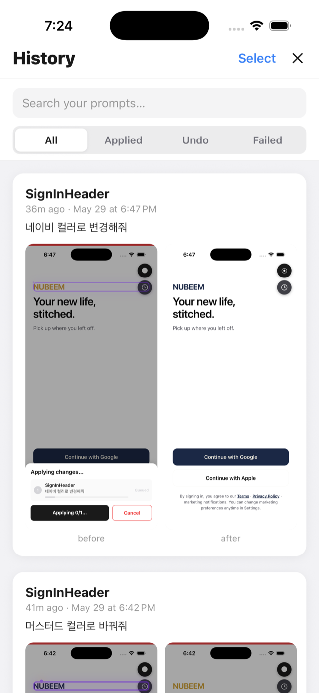
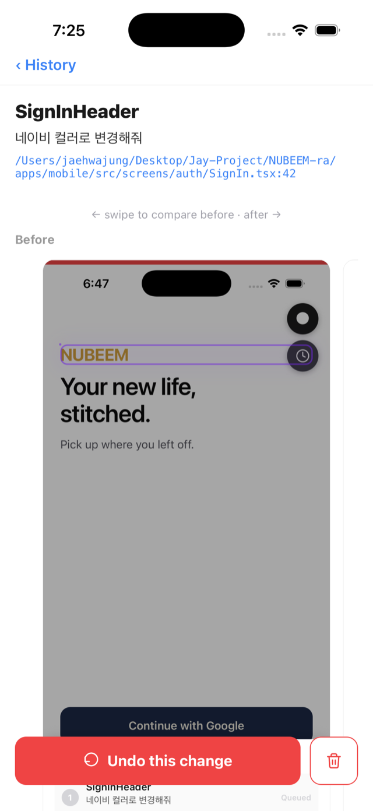

# Re-agentation

> **Point at the thing. Say what you want. Watch it change.**
> Tap any component in your React Native simulator, describe the change in plain language, and Claude edits the right file — while your app is still running.

[](https://github.com/re-agentation/re-agentation/actions/workflows/ci.yml)
[](https://opensource.org/licenses/MIT)
[](#privacy--security)
[](#compatibility)

<p align="center">
  
</p>

<p align="center"><em>Yes, the sparkles are real. No, they are not load-bearing. (Okay, a little.)</em></p>

---

## The 10-second pitch

You're staring at your running app. The headline is too big, the button is the wrong blue, that card needs a tiger photo (don't ask). In a normal week you'd alt-tab to your editor, hunt for the file, find the line, make the change, alt-tab back, wait for reload, repeat.

**Re-agentation collapses that loop to: tap → talk → done.** You never leave the simulator. Claude Code finds the exact file and line, makes the edit, and Metro Fast-Refreshes it back in front of you — usually before you've finished your sip of coffee.

It's [Agentation](https://github.com/benjitaylor/agentation) — but for **React Native**, with batching, a full undo/redo history, before/after screenshots, and (because we have priorities) magic sparkles.

---

## Why this exists

We're living through the strangest moment in product development. AI can scaffold a feature in seconds, refactor a module while you blink, and write tests you'd have procrastinated on for a month. And yet — the part where a human looks at the actual screen and says _"no, **that** one, make **it** warmer"_ is still stuck in 2015.

The design-to-code handoff has quietly become **the** bottleneck. Not the coding. The _pointing_. The translation between "I can see exactly what's wrong" and "here is the file, line, and token that encodes what's wrong." We've automated the hard part and left the obvious part manual.

I saw [Agentation](https://github.com/benjitaylor/agentation) by [Benji Taylor](https://github.com/benjitaylor) and something clicked — _that's_ the missing interface for the AI era: point at the live UI, talk to it, let the agent do the plumbing. It worked beautifully for the web. React Native — where so many of us actually ship — had nothing like it. So I built it.

The hope is small and large at once: that product teams stop losing their best ideas in the gap between "I see it" and "I can describe where it lives," and that we build a smarter, calmer, more human development culture on top of these new AI tools — one where the machine handles the lookup and the person handles the taste.

---

## Table of contents

- [Quick start](#quick-start)
- [Features (with pictures)](#features)
  - [The floating probe](#1-the-floating-probe)
  - [Tap → comment](#2-tap--comment)
  - [Batch up to 3 changes](#3-batch-up-to-3-changes)
  - [Send → Claude edits live](#4-send--claude-edits-live)
  - [The magic-dust apply effect](#5-the-magic-dust-apply-effect)
  - [History: search, filter, before/after](#6-history-search-filter-beforeafter)
  - [Undo / Redo / Delete](#7-undo--redo--delete)
  - [Attach images & video](#8-attach-images--video)
- [How it works (architecture)](#how-it-works)
- [Compatibility](#compatibility)
- [Production safety](#production-safety-dev-only-by-construction)
- [Privacy & security](#privacy--security)
- [Packages](#packages)
- [Contributing](#contributing)
- [About the author](#about-the-author)
- [Credits & license](#credits--license)

---

## Quick start

Install the three packages as dev dependencies:

```bash
pnpm add -D @re-agentation/probe @re-agentation/metro @re-agentation/mcp
# or: npm i -D … / yarn add -D …
```

**1. Mount the probe** (dev-only — it tree-shakes out of production builds):

```tsx
// App.tsx
// Gate the require behind __DEV__ so the probe never ships to production.
const AgentationProbe: () => React.ReactElement | null = __DEV__
  ? require('@re-agentation/probe').AgentationProbe
  : () => null

export default function App() {
  return (
    <>
      <YourApp />
      {__DEV__ && <AgentationProbe />}
    </>
  )
}
```

**2. Add the Metro middleware:**

```js
// metro.config.js
const { withReagentation } = require('@re-agentation/metro')
const { getDefaultConfig } = require('@react-native/metro-config')

module.exports = withReagentation(getDefaultConfig(__dirname))
```

**3. Register the MCP server** with Claude Code (so the agent can read your batches):

```jsonc
// .mcp.json  (or your Claude Code MCP config)
{
  "mcpServers": {
    "re-agentation": { "command": "npx", "args": ["re-agentation-mcp"] },
  },
}
```

**4. Run the auto-apply watcher** once, in your project root, and leave it running:

```bash
npx re-agentation-apply
```

That's it. `pnpm start` your app → tap the floating dot → tap a component → describe the change → **Send**. The watcher runs Claude Code for you and your simulator repaints. No tab-switching required.

> **Don't want auto-apply?** Skip step 4 and just say _"re-agentation, process my batch"_ to Claude Code directly — it'll pull the batch over MCP and edit the files itself.

---

## Features

### 1. The floating probe

A draggable dot lives in the corner of your running app (dev builds only). Drag it to any corner — it snaps and gets out of the way. Tap it to **arm** capture mode; tap again to disarm. A clock icon underneath opens your change [History](#6-history-search-filter-beforeafter).

<p align="center"></p>

### 2. Tap → comment

Armed? Tap any component on screen. Re-agentation resolves **exactly which component you hit** and **the precise source file + line** (more on that black magic [below](#how-it-works)), then slides up a bottom sheet. Type what you want in plain language — _"make this bigger,"_ _"use the brand navy,"_ _"add a tiger"_ — and choose **Add to batch** or **Send now**.

<p align="center"></p>

> Tapping an empty area works too — Re-agentation drops a pin there so you can say _"put an image in this blank space."_

### 3. Batch up to 3 changes

Stack several annotations into one batch (capped at 3, because focused diffs apply more reliably than a shopping list). Edit or delete any item before sending. Tap outside the sheet to **minimize** it to the corner without losing your work.

<p align="center"></p>

### 4. Send → Claude edits live

Hit **Send** and the sheet turns into a live progress view — each item shows _Queued → Editing… → Done_ as Claude works through them. The instant a file is saved, your simulator Fast-Refreshes. New asset or import? Re-agentation does a clean full reload instead, so you **never** get the dreaded red error screen mid-edit.

<p align="center"></p>

### 5. The magic-dust apply effect

While a component is being transformed, a glowing emitter orbits its border and sprays **gold-and-purple magic dust** — particles that launch with the emitter's motion, arc down under gravity, and fade out. It's how you _feel_ the change landing.

<p align="center"></p>

_(Is it strictly necessary? No. Does it make a 4-second wait delightful instead of anxious? Absolutely.)_

### 6. History: search, filter, before/after

Every applied change is recorded with **before & after screenshots** (captured on your Mac, never uploaded anywhere). The History view gives you:

- **Lazy infinite scroll** — 10 entries per page.
- **Search** by your past prompt text or component name.
- **Status tabs** — All · Applied · **Undo** (reverted) · **Failed**.
- Cards with the prompt, a relative + absolute timestamp, and the before/after thumbnails.

<p align="center"></p>

### 7. Undo / Redo / Delete

Open any entry for a swipeable **before/after carousel** (with a peek of the next shot so you know to swipe). Then:

- **Undo** — reverts **every file** Claude touched, not just the one you tapped. (Re-agentation snapshots your working tree with `git stash create` before each edit, so even when your i18n string lived in a totally different JSON file, undo finds it.)
- **Redo** — re-applies a change you undid.
- **Delete** — removes the history entry (with a confirmation modal; your code is untouched). Multi-select in the list for bulk deletes.

<p align="center"></p>

### 8. Attach images & video

In the comment sheet, attach reference images or video from your simulator's gallery. Re-agentation hands them to Claude (videos are sampled into representative frames via `ffmpeg`) so you can say _"make it look like this"_ and mean it.

---

## How it works

Three small packages, one tidy loop, zero cloud.

```
┌─────────────────────┐         ┌──────────────────────┐         ┌─────────────────────────┐
│  @re-agentation/     │  POST   │  @re-agentation/      │  poll   │  @re-agentation/mcp      │
│  probe (in your app) │ ──────► │  metro (dev-server    │ ◄────── │  • MCP server (Claude)   │
│                      │  batch  │  middleware)          │  queue  │  • re-agentation-apply   │
│  • floating probe    │         │                       │         │    watcher               │
│  • tap → capture     │         │  • batch queue        │         │                          │
│  • comment/batch UI  │         │  • history/undo/media │         │  runs headless `claude`  │
│  • magic-dust FX     │         │    stores + endpoints │         │  to edit your files      │
└─────────────────────┘         └──────────────────────┘         └────────────┬────────────┘
          ▲                                                                     │
          │                      Metro Fast Refresh / clean reload              │
          └─────────────────────────────────────────────────────────────────────┘
```

**The capture trick.** When you tap, the probe asks React DevTools' renderer (`getInspectorDataForViewAtPoint`) what's under your finger. On the New Architecture (Fabric) the public instance hides at `stateNode.canonical.publicInstance`, so we dig it out, then walk the fiber's `_debugStack` (React 19's source channel) and run it through Metro's `/symbolicate` endpoint to get an exact `app/.../File.tsx:line:col`. Library frames inside `node_modules` are discarded so you always land on **your** code (and if nothing resolves, Claude just greps by component name).

**The apply loop.** The watcher polls Metro's queue. For each item it: snapshots the working tree (`git stash create`) for undo, takes a _before_ screenshot (`xcrun simctl io screenshot`), runs `claude -p --permission-mode acceptEdits` against the resolved file, then acks the moment **either** the file changes **or** Claude exits (whichever comes first — so a no-op never stalls the queue). If the edit added or removed an import/asset it triggers a clean reload; otherwise Fast Refresh handles it. Finally it takes an _after_ screenshot and writes a history entry.

**Undo that actually works.** Because we snapshot the whole tree before editing, undo restores the original bytes of _every_ file the edit changed — and `redo` re-applies them. New files get deleted on undo and recreated on redo.

For the full design rationale, see [ARCHITECTURE.md](./ARCHITECTURE.md).

---

## Compatibility

| Surface      | Supported                                                         |
| ------------ | ----------------------------------------------------------------- |
| React Native | 0.76+                                                             |
| Architecture | New Architecture (Fabric)                                         |
| React        | 18 & 19                                                           |
| Setup        | Bare RN CLI + Expo (SDK 52+)                                      |
| JS engine    | Hermes & JSC                                                      |
| Platform     | iOS Simulator, Android Emulator (real device works with LAN host) |
| Agent        | Claude Code (via MCP) + the `re-agentation-apply` watcher         |

Verified end-to-end on **RN 0.85.3 + React 19.2.3 + Hermes + Fabric** (iOS Simulator).

For Next.js / DOM apps, use the original [Agentation](https://github.com/benjitaylor/agentation) — it already nails the web.

---

## Production safety (dev-only by construction)

Re-agentation **cannot ship in a production build**. There's nothing to remember to turn off — it's excluded by three independent layers:

1. **Runtime guard** — the probe returns `null` when `__DEV__` is false.
2. **Tree-shaking** — the recommended `__DEV__ ? require(...) : () => null` pattern lets Metro's release minifier dead-code-eliminate the whole probe package; it isn't bundled at all.
3. **No Metro = no backend** — the queue, history/undo/media stores, and `/__agentation__/*` endpoints live in the Metro **dev server**. A release app ships a static bundle with no Metro, so that surface simply doesn't exist.

The MCP server and watcher are local CLI tools you run by hand — never part of an app binary.

---

## Privacy & security

- **Zero telemetry.** No analytics, no phone-home, no "anonymous usage stats." Ever.
- **Everything is local.** Batches, screenshots, and history live on your machine under `.agentation/`. Nothing is uploaded.
- The only thing that leaves your computer is whatever **Claude Code** itself sends to Anthropic when it edits code — exactly like any other Claude Code session.
- Add `.agentation/` to your `.gitignore`.

---

## Packages

| Package                                  | What it does                                                                 |
| ---------------------------------------- | ---------------------------------------------------------------------------- |
| [`@re-agentation/probe`](packages/probe) | The in-app RN overlay — probe, capture, comment/batch UI, history, FX        |
| [`@re-agentation/metro`](packages/metro) | Metro middleware — batch queue + history/undo/media stores + endpoints       |
| [`@re-agentation/mcp`](packages/mcp)     | MCP server (stdio + HTTP/SSE) + the `re-agentation-apply` auto-apply watcher |

---

## Contributing

**Please do.** A confession: I'm a product manager, not a career engineer — Re-agentation was built with a lot of help from AI and even more stubbornness. That means there are almost certainly rough edges, missed cases, and bugs hiding in here that a seasoned RN engineer would spot in a heartbeat.

So: issues, bug reports, PRs, "this is not how you do X" — all genuinely, enthusiastically welcome. If this tool saves you ten tab-switches a day, paying a little of that back in contributions would make my week.

```bash
git clone https://github.com/re-agentation/re-agentation
cd re-agentation && pnpm install
pnpm -r build && pnpm -r test
```

See [CONTRIBUTING.md](./CONTRIBUTING.md) and our [Code of Conduct](./CODE_OF_CONDUCT.md).

---

## About the author

Built by **Jaehwa Jung** — a product manager with 15+ years shipping products across Korea and the US, currently based in **Seoul, South Korea**. I've spent my career on the seam between people who can _see_ what a product should be and people who can _build_ it, and Re-agentation is my attempt to make that seam a little less painful in the AI era.

Questions, ideas, or just want to say hi?

- ✉️ **[jhjh7306@gmail.com](mailto:jhjh7306@gmail.com)**
- 💼 **[linkedin.com/in/jaehwajung](https://www.linkedin.com/in/jaehwajung/)**

My genuine hope is that this helps product teams everywhere work a little more efficiently — and that, together, we build smarter, more humane development processes and culture for the age of AI.

---

## Credits & license

Inspired by **[Agentation](https://github.com/benjitaylor/agentation)** by [Benji Taylor](https://github.com/benjitaylor) — the original "tap the UI, talk to the agent" idea for the web. Re-agentation brings the concept to React Native, with thanks and admiration.

**MIT** © 2026 Jaehwa Jung & Re-agentation contributors. See [LICENSE](./LICENSE).
